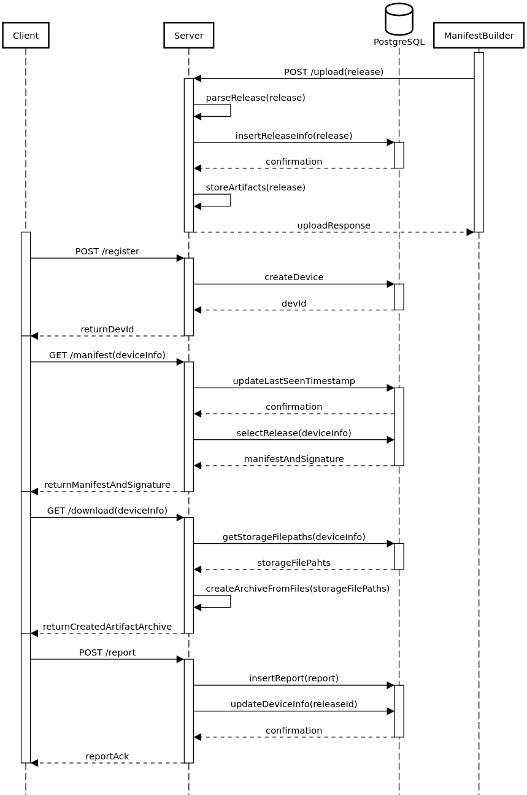
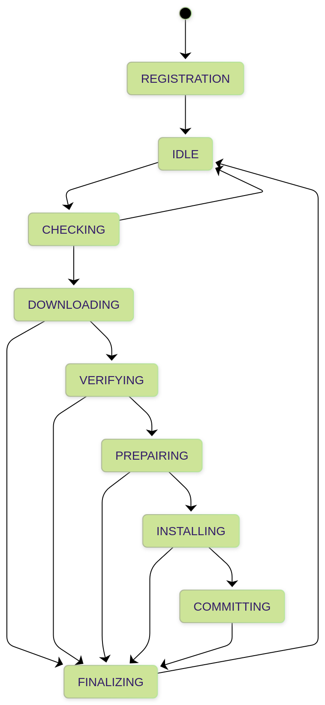

# POSIX Compatable OTA system

**PCO** — дипломный проект, представляющий собой OTA-систему для обновления userspace-приложений на устройствах под управлением POSIX-совместимых операционных систем.

## Основные возможности системы

- централизованное управление процессом обновления устройств по сети;
- регистрация устройств на сервере и хранение их состояния;
- периодическая проверка наличия обновлений на основе манифестов;
- проверка подлинности и целостности манифестов с использованием электронной подписи;
- контроль целостности загружаемых артефактов перед установкой;
- поддержка пользовательских предустановочных и постустановочных скриптов на языке sh для гибкой настройки процесса обновления;
- формирование и передача на сервер отчётов о результатах обновления;
- поддержка канареечного развертывания обновлений;
- переносимость на разные POSIX-системы за счёт использования стандартного POSIX API;
- защищённый обмен данными по HTTPS с использованием взаимной аутентификации mTLS

## Архитектура системы

Система состоит из четырёх компонентов: клиентского приложения на устройстве, серверного приложения, базы данных PostgreSQL и подписывающего сервера, который не входит в данный проект. Взаимодействие между ними осуществляется через HTTP-эндпоинты, включающие регистрацию устройств, получение манифестов, скачивание артефактов, передачу отчётов на сервер и загрузку обновлений на сервер.

  

### Клиентская часть

Клиентская часть реализована в виде **конечного автомата** с девятью состояниями. 

Состояния автомата:

- **REGISTRATION** — регистрация устройства на сервере при первом запуске.
- **IDLE** — ожидание интервала между запросами манифестов.
- **CHECKING** — запрос манифеста и проверка его корректности и подлинности.
- **DOWNLOADING** — скачивание и распаковка архива с обновлением.
- **VERIFYING** — проверка хэш-сумм загруженных артефактов.
- **PREPARING** — запуск предустановочных пользовательских сценариев на языке sh для подготовки окружения.
- **INSTALLING** — размещение артефактов в целевых директориях и создание резервных копий для отката.
- **COMMITTING** — запуск послеустановочных сценариев и финальная настройка обновленных компонентов.
- **FINALIZING** — очистка контекста, удаление временных файлов и отправка отчета на сервер.

В критических состояниях происходит сохранение контекста обновления в энергонезависимую память, что обеспечивает отказоустойчивость и возможность возобновления процесса обновления после сбоев или потери питания.

  

### Серверная часть

Серверная часть построена по **двухслойной архитектуре**:

- **Слой контроллеров** — обработка входящих HTTP-запросов.
- **Слой сервисов** — логика управления устройствами и обновлениями.

Реализованы две стратегии развертывания обновлений:  

- **Массовое** — обновление всех устройств заданного типа.  
- **Канареечное** — поэтапное обновление с контролем успешности на ограниченной выборке устройств.  

Сервер выполняет **фоновый мониторинг устройств** путем отслеживания тайм-аутов процессов обновления и активности устройств по отправке запросов на получение манифеста.
